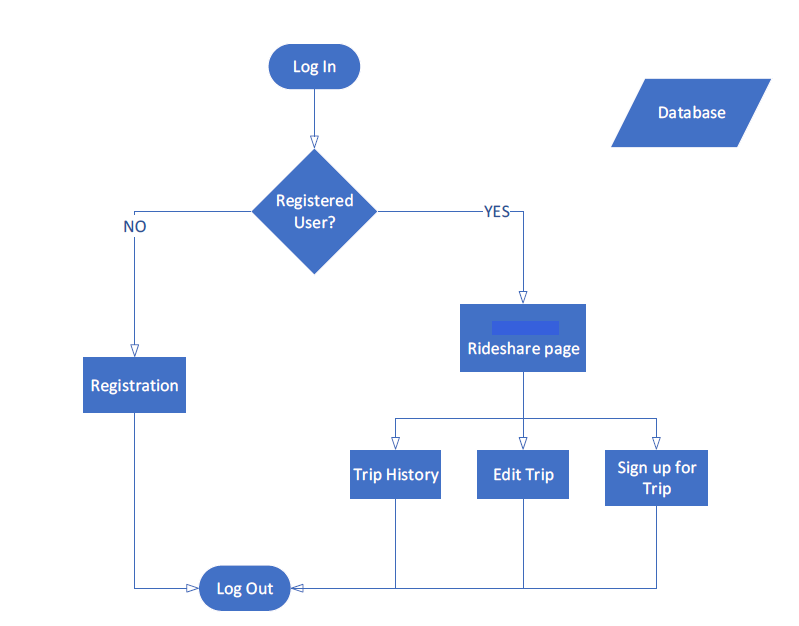
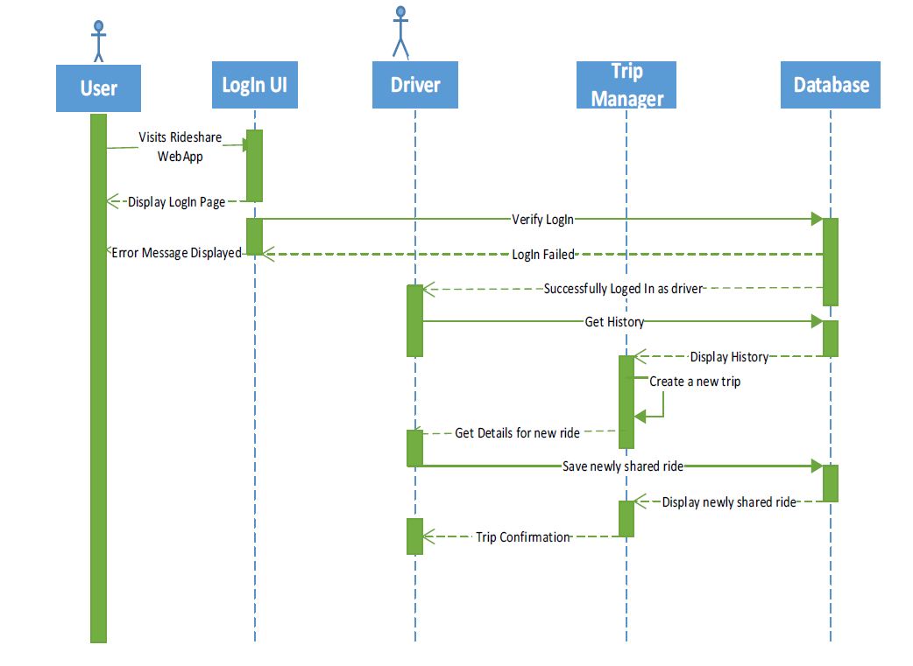
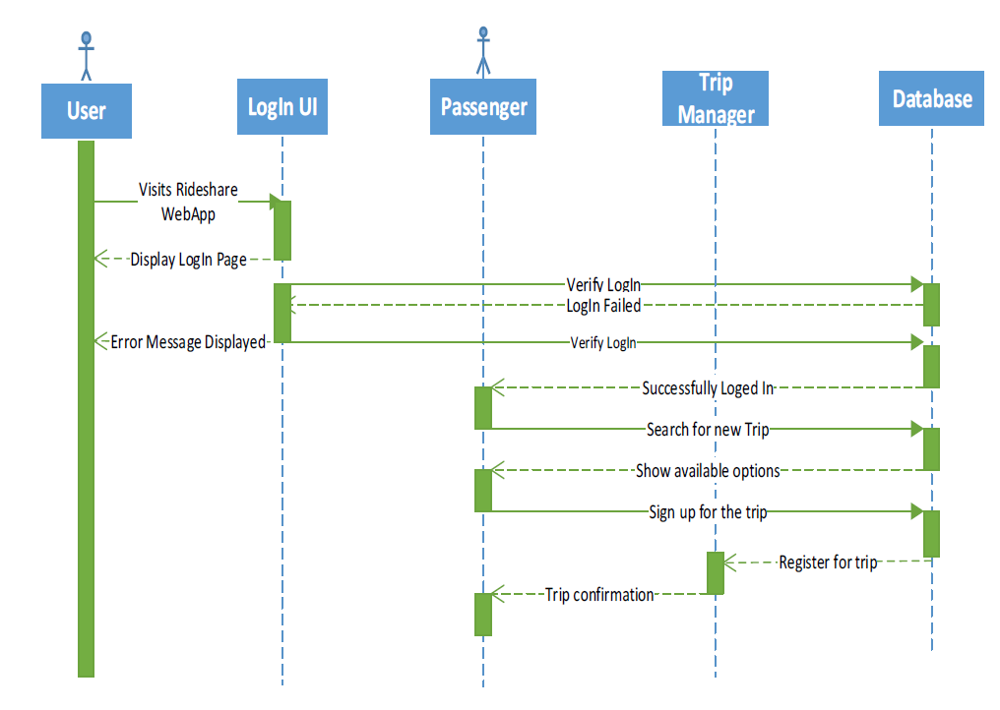

# RideShare
Rideshare is a similar concept to Uber, i.e. it facilitates the carpooling option to its users. A user can either be a driver or a passenger. The driver can offer a ride and passenger can request for a ride. If both parties agree they can share the ride. The activity diagram of Rideshare is as follows  
  
Sequence diagram - Driver shares a ride  
  
Sequence diagram - Passenger requests for a trip  

